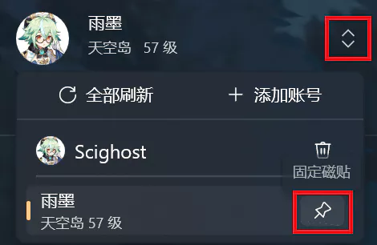
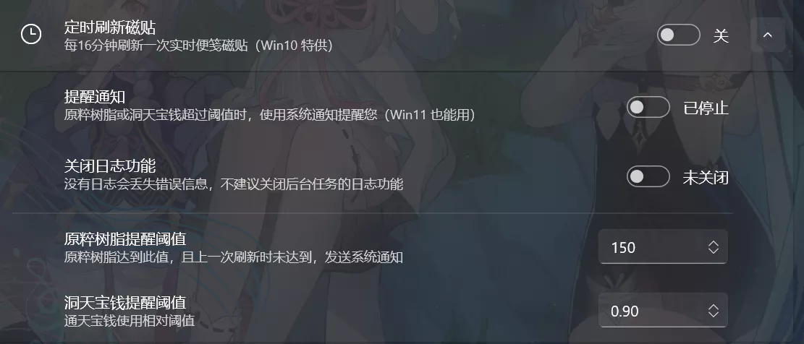

# 实时便笺

::: tip 提示
此功能需要 [添加米游社账号](account.md)
:::

## 应用内便笺

略。。。

## 参量质变仪提醒

0.1.4.3 版本新增参量质变仪提醒功能。

在应用内添加账号后，使用 [寻空启动器](./startgame.md) 启动游戏后，自动获取所有账号的参量质变仪的状态，如果冷却时间已到，则发送系统通知（全屏游戏时系统通知无法弹出）。

此功能默认开启，无法关闭，且仅在使用 [寻空启动器](./startgame.md) 后触发操作。

参量质变仪的冷却时间精度不高，会看到 `x天0小时后可再次使用` 并保持很长时间，属于正常情况。

> 若无法接收到通知，请检查系统设置 [通知与操作](ms-settings:notifications) 。

## Windows 10 磁贴

### 固定磁贴

如图，依次点击红框内的按键。

固定到开始菜单的磁贴有 `小`、`中`、`宽`、`大` 四种大小，建议使用 **宽磁贴** 或 **大磁贴**。

### 磁贴样式

::: tip 提醒
图中的时间是树脂完全恢复，探索派遣任务完成的时刻，**不是**剩余时间。
:::

### 定时刷新

转到设置界面

### 手动刷新

点击开始菜单中已固定的磁贴，此方法不会打开寻空的主窗口。
