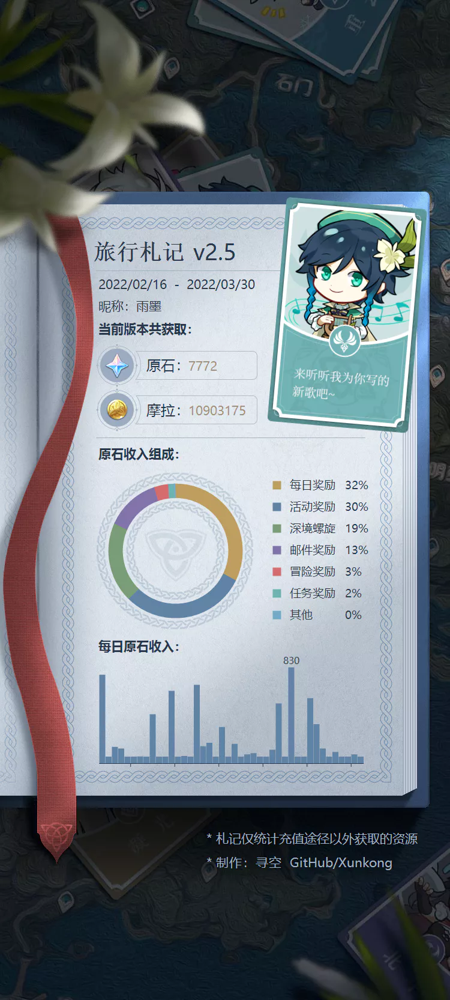

# 旅行札记

::: tip 提示
此功能需要 [添加米游社账号](account.md)
:::

## 获取数据

打开界面后会自动获取**实时数据**，**历史数据**需要手动点击右上角的**获取记录**按键。

::: tip 提示
每月月初（凌晨4点后）记得点击一次**获取近三月数据**，以保证不丢失上月末数据。
:::

## 旅行札记生成器

功能位于 工具箱 > 旅行札记生成器，这是一个模仿米游社的旅行者札记生成可用于分享的图片的功能，但是是以**每个版本**为统计周期。

**旅行札记示例**

