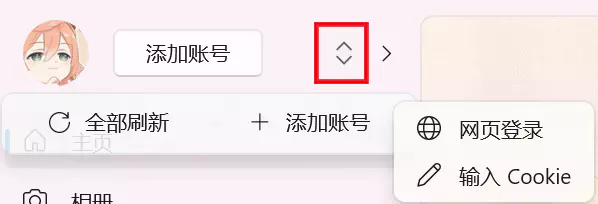

# 添加米游社账号

::: tip 提示
寻空的很多功能需要使用米游社的账号，您的账号数据仅会存储在本地。
:::



点击添加账号按键，或点击红框内的按键后，选择添加账号的方式。

## 通过网页登录添加账号

根据提示进行操作。

## 通过 Cookie 添加账号

> 需要的是访问 `https://bbs.mihoyo.com/ys/` 页面时发送的 Cookie（复制 Header 中的内容即可）

- 把右侧的文字拖入浏览器书签栏 <a href="javascript:(()=>{if(location.host.includes('www.miyoushe.com') || location.host.includes('bbs.mihoyo.com')){var cookie=document.cookie;navigator.clipboard.writeText(cookie);alert('Cookie 已复制到剪贴板')}else{alert('当前网页不为米游社页面')}})();">获取米游社 Cookie</a>
- 使用浏览器的**无痕模式**打开 [米游社·原神](https://bbs.mihoyo.com/ys/)页面
- 登录您需要添加到寻空中的账号
- 点击之前添加的书签，此时 Cookie 已被复制到剪贴板
- 在寻空中点击 **添加账号 > 输入 Cookie**，粘贴上述过程中复制的内容并点击确认

## 常见问题

### 支不支持国际服

不支持，所有和米游社相关的功能仅支持国服。

### 如何添加多个账号

通过网页登录的方法时，重复第一步打开新的页面。

通过输入 Cookie 的方法时，使用**无痕模式**打开**新的** [米游社·原神](https://bbs.mihoyo.com/ys/) 页面，重复上述步骤。

### 出现 HoyolabException (-100) 错误

可能的原因：

- 该账号已退出登录

在任意端退出登录米游社账号均会导致当前 Cookie 失效，非必要不点击退出登录按键。

## 书签内容

``` js
javascript: (() => {
    if (location.host.includes('www.miyoushe.com') || location.host.includes('bbs.mihoyo.com')) {
        var cookie = document.cookie;
        navigator.clipboard.writeText(cookie);
        alert('Cookie 已复制到剪贴板');
    } else {
        alert('当前网页不为米游社页面');
    }
})();
```
