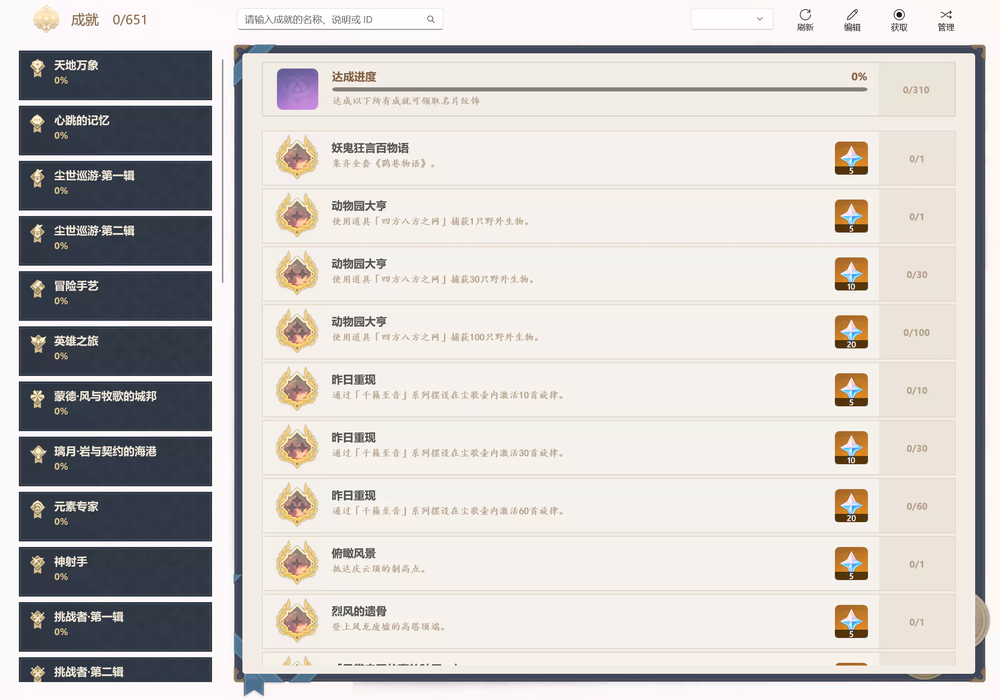
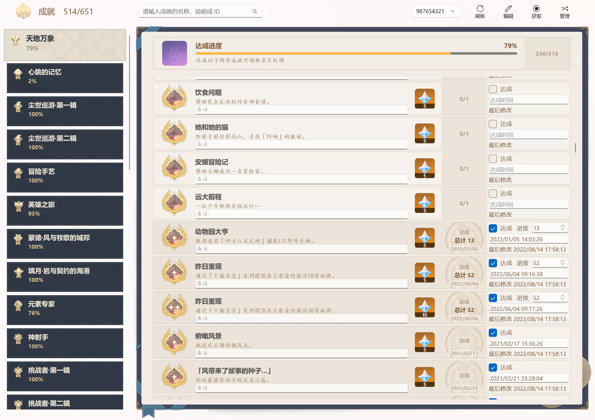
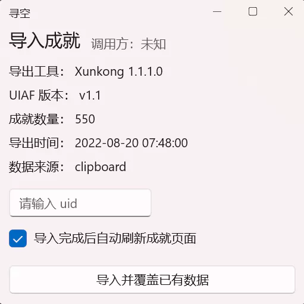
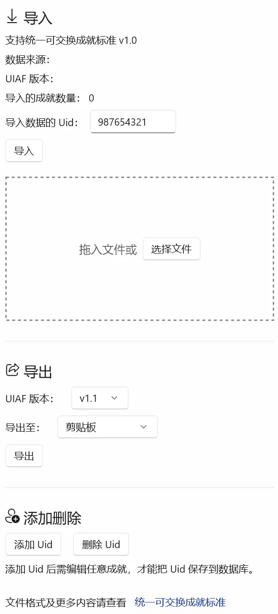

# 成就管理

## 写在前面

本来我觉得自己不需要成就相关的功能，我不是成就党，也对满成就没有兴趣。直到一周前触发了任务「有一说一」，那种知道自己做过忘了选过什么又想达成成就但是怕选错不知道下次什么时候再来的感觉真的特别糟心，所以有了这个功能。

## 功能介绍

从左侧导航栏进入**成就管理**页面后可以看到下面这张图的内容（有参考的界面做完之后就是好看）：

成就内容就不解释了，懂得懂得。重点在于右上角的 **编辑**、**获取**、**管理** 三个功能。

成就页面截图

### 编辑

成就功能的账号是独立的账号，和米游社账号和祈愿记录的账号没有任何关联，首次开启编辑时需要输入 Uid，随后进入编辑模式。

编辑模式截图

每条成就可以修改的属性有 **达成**、**进度**、**达成时间**、**备注**。

- **达成**的优先级高于**进度**；
- 修改某一成就的**进度**后相关成就的进度也会随之更改，高于需求值时会自动**达成**；
- 通过点击**达成**或增加**进度**完成成就后，**达成时间**也会自动更新；
- 单独更改**达成时间**和**备注**不会影响其他两个属性，**备注**显示在成就说明下方；
- 以上任意属性有变更时，**最后修改时间**将会更新；
- 当编辑框**失去焦点**时自动保存编辑后的数据，再次点击编辑按键关闭编辑模式。

> 在编辑模式下达成一组成就后会出现一个小彩蛋

### 获取

寻空使用 [YaeAchievement](https://github.com/HolographicHat/YaeAchievement) 自动获取成就，**此工具将 DLL 注入到原神进程后转发数据包，有非常高的风险，可能会被检测为第三方工具导致封号**。

点击获取按键并选择**接受风险**后，将会请求以管理员权限打开成就工具，随后打开原神游戏本体，在游戏内进门后等待获取完成。
如果正常运行就会弹出以下窗口，输入 Uid 后选点击导入。

使用 YaeAchievement 导入

你也可以使用其他更安全的工具后再导入数据，详见管理功能。

### 管理

点击管理按键后会在右侧弹出管理面板，有**导入**、**导出**、**添加**、**删除**等功能。

管理面板

寻空支持以 [统一可交换成就标准](https://www.snapgenshin.com/development/UIAF.html) 的格式导入导出成就数据，你可以选择支持相同标准的其他工具获取成就后导入寻空。
因为此标准没有定义用户的 Uid，所以在导入数据时必须输入 Uid，导入数据后需要点击刷新按键。

成就功能支持任意数量的 Uid，如果你想手动添加其他的 Uid，点击 **添加 Uid** 按键后，需要**在编辑模式下修改任意属性**才能保存输入的 Uid。

**导出**和**删除 Uid**的操作都是针对页面顶部的**工具栏**中显示的 Uid，而**不是**在导入时输入的 Uid。

## 写在后面

寻空的成就功能不会加入相关的任务攻略，有需求可以去找 [椰羊](https://cocogoat.work/achievement)。

最后，特别感谢 [HolographicHat](https://github.com/HolographicHat) 对寻空成就功能的帮助。
