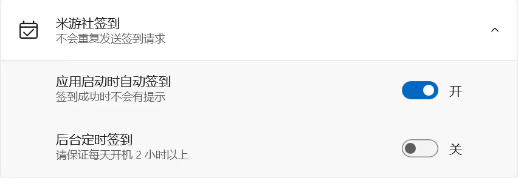

# 其他

> 一些其他的功能
## 应用内便笺

点击红框右侧的按键，可以查看实时便笺。

## Windows 10 磁贴

::: tip 提醒
因为在 Windows 10 系统上后台任务运行失败（仍未知原因），已固定的磁贴无法定时刷新，如有需要请使用 [寻空小组件](../../download/xunkong-widget.md) 代替。
:::

## 米游社签到

设置界面如图，打开**启动应用时自动签到**后，签到成功则记录时间，保证当天启动时不会重复签到，签到失败则弹出横幅提醒。  
因为应用框架的限制，无法在开机时或固定时间运行后台任务，所以加入了一个定时签到的任务，每隔2小时自动运行。

