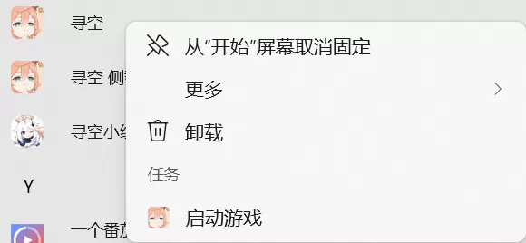
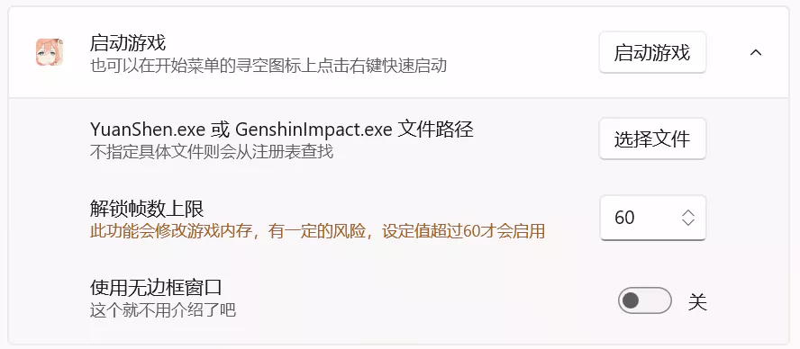

# 启动游戏

使用寻空启动游戏可以使用 **解锁帧数上限**、**无边框窗口** 等功能。

## 使用

开始菜单右键点击寻空的图标

::: tip 注意
在 Windows 11 系统上，开始菜单**已固定**和**推荐的项目**区域内的图标没有自定义菜单的功能，开始菜单的**所有应用**和桌面**任务栏**区域内的图标才有自定义的功能。
:::

## 设置

依次点击 **设置 > 功能 > 启动游戏**，会出现如下界面。

::: warning 警告
当设置帧数**超过60**时，会修改原神进程的内存解锁帧数上限，请自行考虑风险。
:::

## 其他

使用寻空启动游戏后，会检查已添加账号的**参量质变仪**的状态，如果能够使用，则会发送系统通知（全屏游戏时无法收到通知）。