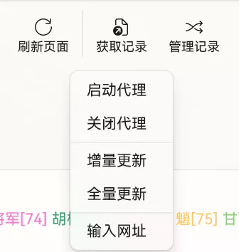
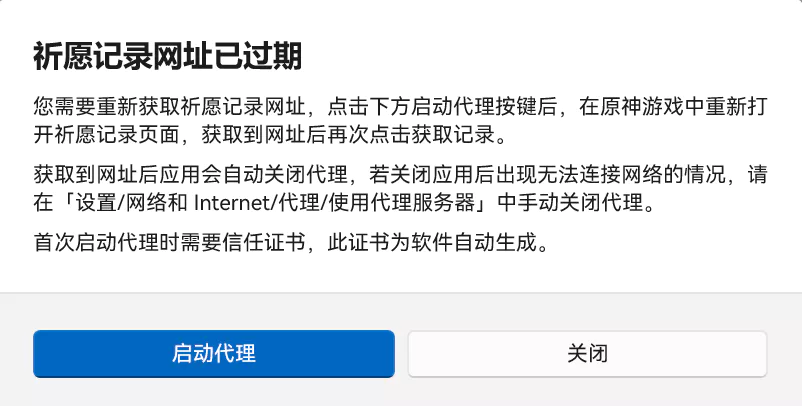
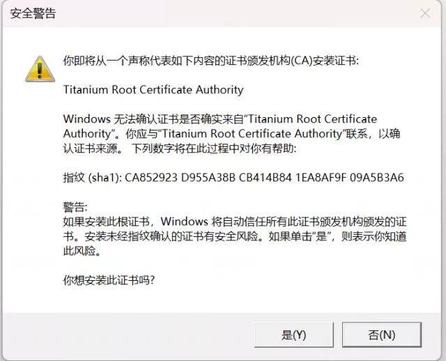
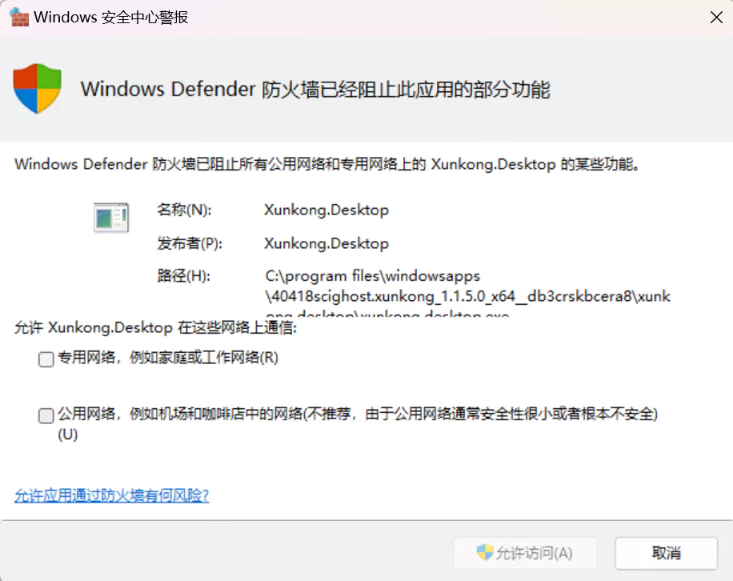
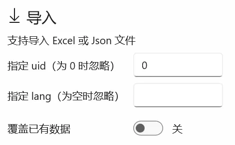

# 祈愿记录

::: tip 提示
此功能仍存在性能问题，界面卡死是正常现象。
从原神 3.0 版本开始更改了祈愿记录网址的获取方式。
:::

## 获取记录



首先点击此处的**获取记录**，如果祈愿记录网址已过期，则会显示如下内容，点击**启动代理**。



如果是首次启动代理，则会要求**安装证书**，一定要安装，否则无法获取到网址。      
这个证书是软件自动生成的，每个人都不一样，不用担心会被滥用。



可能还会出现以下页面，允许或取消**应该**都可以。



代理启动之后，在原神中**重新打开祈愿历史记录页面**，然后会弹出通知已获取网址，同时网址也将会复制到剪贴板。


最后返回到第一步，再次点击获取记录。

部分非常火爆的卡池可能会出现短时间内记录缺失的现象，请等一段时间后点击**全量更新**，如果没有安装原神但有日志的网址可以点击**输入网址**。

## 需要注意地方

获取到网址后，应用会自动关闭代理，不排除关闭失败的情况，如果应用内出现**目标积极拒绝**的错误，需要手动关闭代理后重启应用。

获取到网址后，应用左上角的选择框内会显示相关的 Uid，如果没有出现，则可能出现了未知的错误。

获取到网址后，会把该网址复制到剪贴板，出现了异常情况，也可以通过输入网址获取记录。

## 云备份

寻空提供祈愿记录的云备份功能，**但是不能保证服务的可靠性**。

云备份功能使用 **从您本地原神日志中找到的祈愿记录网址** 验证账号所有权，验证通过即视为您本人操作，可从服务器中 `下载`、`上传`、`删除` 相关 Uid 的祈愿记录。

服务器没有冗余备份，定期备份由阿里云提供。


## 导入与导出

点击**祈愿记录**页面右上角的**管理记录**按键，然后再点击右上角的**导入导出**按键。

### 导入

::: tip 提示
由于依赖库的限制，导入功能不完全支持 [UIGF v2.2](../../archive/UIGF-v2.2.md) 。
:::

支持使用 Excel 或 Json 文件导入

#### Excel 文件

导入的 Excel 文件中需含有名为 `原始数据` 的工作表，表的内容如下：

| 列名       | 备注                        |
| ---------- | --------------------------- |
| gacha_type | 祈愿类型，`200`、`301`……    |
| id         | 祈愿记录 id                 |
| item_type  | 物品类型，`角色`、`武器`    |
| lang       | 语言，`zh-cn`、`en-us`……    |
| name       | 物品名称                    |
| rank_type  | 物品等级                    |
| time       | 时间，`2022-04-11 09:52:04` |
| uid        | 账号 uid                    |

上述所有列名**必须**存在，除了 `lang` 和 `uid` 外，其他列**必须**有值，列的顺序没有要求。

#### Json 文件

寻空会遍历 Json 文件的每个元素，但只有以下格式的对象才会被解析：

``` json
{
    "uid": "123456789",             // 非必需
    "gacha_type": "100",            // 必需
    "time": "2021-02-14 21:50:21",  // 必需
    "name": "神射手之誓",            // 必需
    "lang": "zh-cn",                // 非必需，但不得为 null
    "item_type": "武器",            // 必需
    "rank_type": "3",               // 必需
    "id": "1613307960000763747"     // 必需
}
```

#### 数据补全

对于 [UIGF v2.2](../../archive/UIGF-v2.2.md) 中定义为非必需，但是在寻空中必需的字段，导入过程中提供数据补全功能，但是导入时填入的补全值不得与导入文件中的已有值冲突。

例如，导入文件中的 `uid` 有值 `0`、`123456789`，此时指定uid 可以填写 `123456789`，**不得**填写其他值如 `987654321`。

每次导入仅支持单文件单账号，如果文件内有多个账号的数据则会报错。

导入前会自动备份数据库内该 uid 的所有记录。


::: warning 警告
[UIGF v2.2](../../archive/UIGF-v2.2.md) 中定义 `time` 为非必需，但是寻空不支持没有 `time` 的数据导入。
:::



### 导出

导出功能支持 [UIGF v2.2](../../archive/UIGF-v2.2.md) 的全部值，文件路径为

`我的文档\Xunkong\Export\Wishlog\Wishlog_uid_yyyyMMdd_HHmmss.(json/xlsx)`

### 导入过程中的常见错误

#### Imported wishlogs have items without uid

Json 文件中没有 `uid` 字段或 `uid` 字段为 `"0"`。

#### Please check sheetName/Index is correct

Excel 文件的工作表格式与上述要求不相符，请仔细检查每一列。

#### DbUpdateException

一般情况下是因为 Json 文件中的某些字段的值为 `null`，需修改为相应的正确值。

若仍出现此问题，请去 [提 Issue](https://github.com/Scighost/Xunkong/issues) 并附上相关日志。
