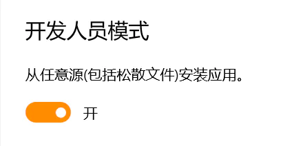
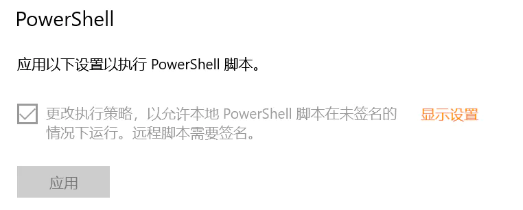
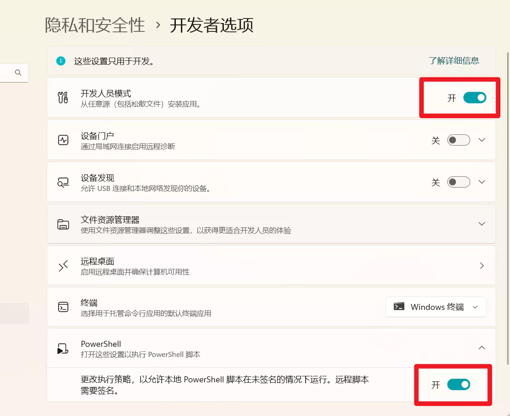

# 下载安装

## 环境要求

Windows 10 1809 及以上版本（最低版本出自微软文档，可靠性未知），建议升级到最新版以避免可能出现的各种问题。

升级 [应用安装程序](https://www.microsoft.com/zh-cn/store/productId/9NBLGGH4NNS1) 至最新版本。

## 下载

通过以下链接下载最新版本的完整安装包：

> MD5: 9E34D6F5C6659A1E76E1F1C852934A14

[线路一](https://file.xunkong.cc/download/package/Xunkong.Desktop.Package.zip)

[线路二](https://scighost-generic.pkg.coding.net/xunkong/releases/Xunkong.Desktop.Package.zip)

## 安装

安装前需要在系统设置 [开发人员选项](ms-settings:developers) 中打开 **开发人员模式** 和 **允许PowerShell脚本** 。

Windows 10

Windows 11

### 自动安装

- 解压已下载的安装包
- 找到名为 **Install.ps1** 的文件，右键点击打开菜单
- 点击 **使用 PowerShell 运行**
- 根据提示完成后续操作
- 安装完成后，点击开始菜单的寻空图标启动应用

### 手动安装

- 解压已下载的安装包
- 把名为 `Xunkong.Desktop.Package.cer` 的证书添加至 **计算机 > 受信任人**
- 安装 `Dependencies\x64\` 文件夹内的所有依赖包
- 安装 `Xunkong.Desktop.Package.msixbundle`

::: warning 警告
安装不信任的证书是一件危险的事情，此证书仅有代码签名的功能且仅用于寻空项目。
:::

## 后续

后续的使用教程请浏览 [帮助部分](../../help/desktop/index.md)。

## 可能遇到的问题

#### 无法加载文件 Install.ps1，因为在此系统中禁止执行脚本。

以管理员身份运行 PowerShell，输入 `Set-ExecutionPolicy RemoteSigned` ，然后按下回车。

上述语句的作用是允许本地计算机中未签名的脚本运行。

#### 应用安装在哪里

以 MSIX 打包的应用安装在 `C:\Program Files\WindowsApps` 文件夹内。

::: tip 提示
使用深色模式视觉效果更佳
:::
